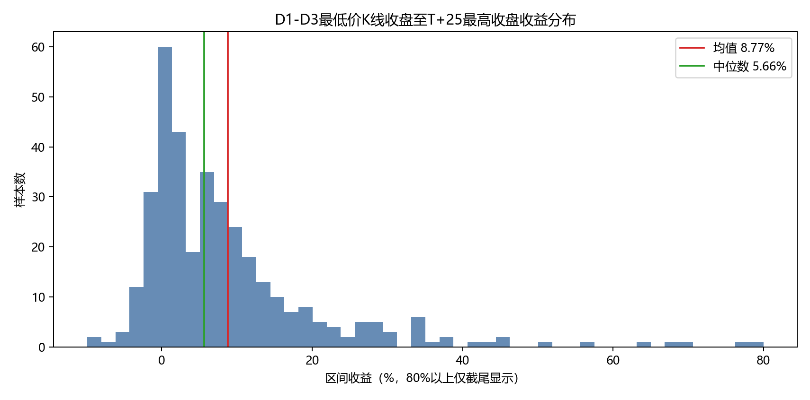
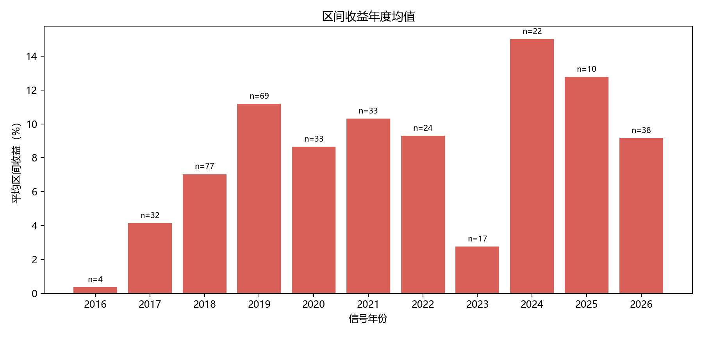
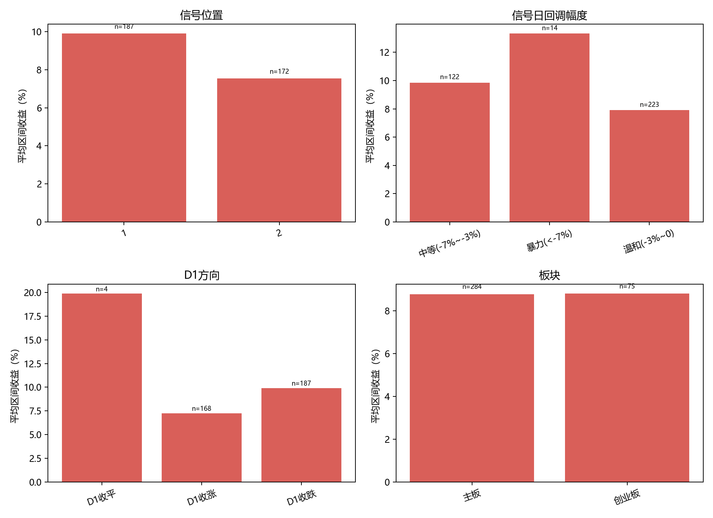
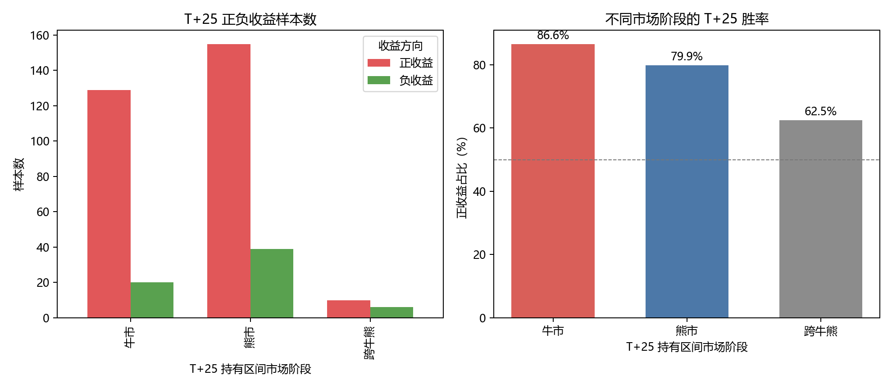
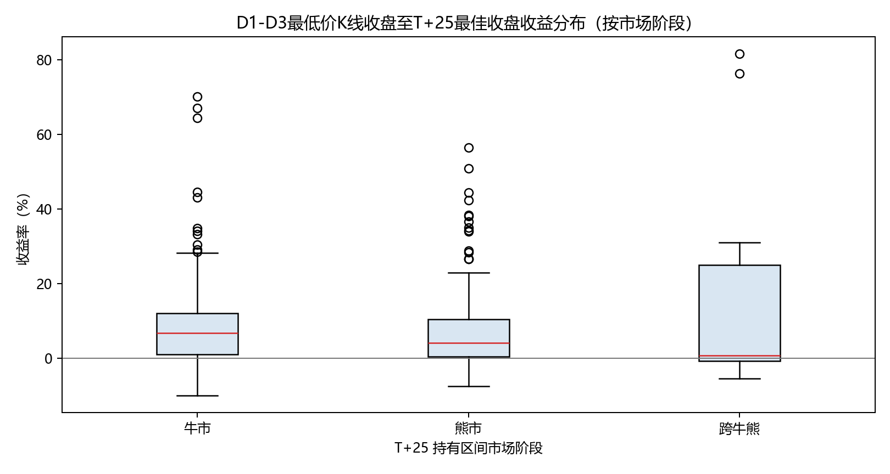

# 一字板回调策略：最终回测报告

## 策略规则

研究对象是一字涨停后两根有效K线内首次跌破板价的回调形态。D0前紧邻3根有效K线均不得涨停；排除新股期与疑似ST；同时使用月度涨幅和近三个月低点约束。

## 收益口径

买入点为D0后第1至第3根有效K线中最低价最低的K线收盘价；卖出点为买入后T+1至T+25内最高后复权收盘价。同日不可卖出，T+25从买入日计算。终点是事后窗口最高收盘价，表示策略的客观路径能力，不代表可预知成交收益。

## 核心结果

| 事件数 | 有效路径样本 | 区间均值 | 中位数 | P10 | P90 | 正收益占比 | 路径平均超额 |
|---:|---:|---:|---:|---:|---:|---:|---:|
| 368 | 359 | +8.77% | +5.66% | -1.20% | +23.17% | 81.9% | +5.54% |

有效路径样本为359个；无效样本包括买入点早于信号日或后续行情不足。

## 分组统计

### 信号位置
| 分组 | 样本数 | 区间均值 | 中位数 | P10 | P90 | 路径平均超额 |
|---|---:|---:|---:|---:|---:|---:|
| 1 | 187 | +9.91% | +6.27% | -1.09% | +27.75% | +6.16% |
| 2 | 172 | +7.54% | +4.12% | -1.23% | +19.50% | +4.87% |

### 信号日回调幅度
| 分组 | 样本数 | 区间均值 | 中位数 | P10 | P90 | 路径平均超额 |
|---|---:|---:|---:|---:|---:|---:|
| 中等(-7%~-3%) | 122 | +9.84% | +5.96% | -1.14% | +26.47% | +6.06% |
| 暴力(<-7%) | 14 | +13.33% | +9.75% | -0.21% | +35.89% | +5.02% |
| 温和(-3%~0) | 223 | +7.90% | +5.24% | -1.23% | +20.17% | +5.28% |

### D1方向
| 分组 | 样本数 | 区间均值 | 中位数 | P10 | P90 | 路径平均超额 |
|---|---:|---:|---:|---:|---:|---:|
| D1收平 | 4 | +19.87% | +2.17% | -0.65% | +54.56% | +10.05% |
| D1收涨 | 168 | +7.25% | +4.81% | -1.21% | +19.41% | +4.74% |
| D1收跌 | 187 | +9.91% | +6.27% | -1.09% | +27.75% | +6.16% |

### 板块
| 分组 | 样本数 | 区间均值 | 中位数 | P10 | P90 | 路径平均超额 |
|---|---:|---:|---:|---:|---:|---:|
| 主板 | 284 | +8.77% | +5.42% | -0.69% | +23.04% | +5.69% |
| 创业板 | 75 | +8.80% | +7.18% | -2.09% | +23.13% | +4.97% |

## 市场阶段

[市场阶段样本图](../figures/market-regime-samples.html)

## 样本图

[代表性样本图](../figures/representative-samples.html)

[暴力与中等回调样本图](../figures/pullback-samples.html)

## 结论与限制

D1-D3买入收盘至T+25最佳收盘均值+8.77%、中位数+5.66%。这反映窗口内的反弹路径空间，不等于可直接执行的正期望。

买入K线和最佳卖出日均为事后识别；结果未计佣金、滑点、涨跌停排队、仓位和资金占用。

## 文件

事件明细：results/events.csv；统计结果：results/summary.csv；策略入口：strategy/pattern.py；市场阶段分析：strategy/market_regime_analysis.py；报告生成：strategy/build_report.py
