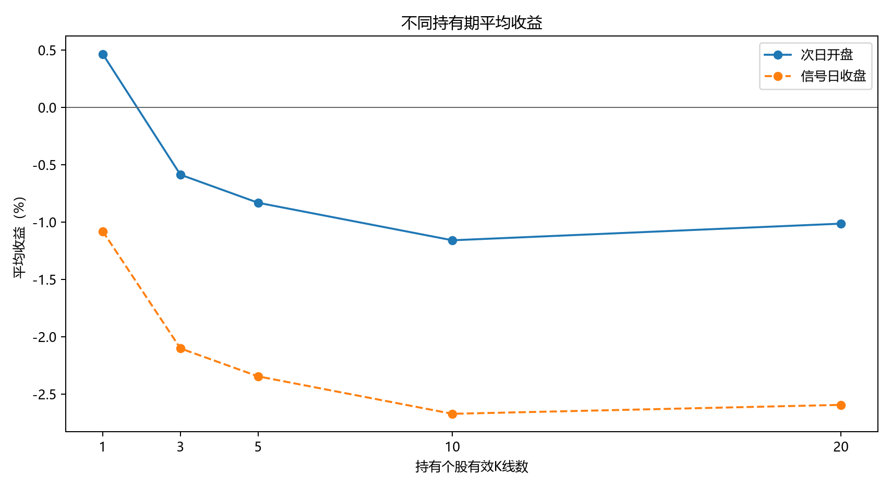
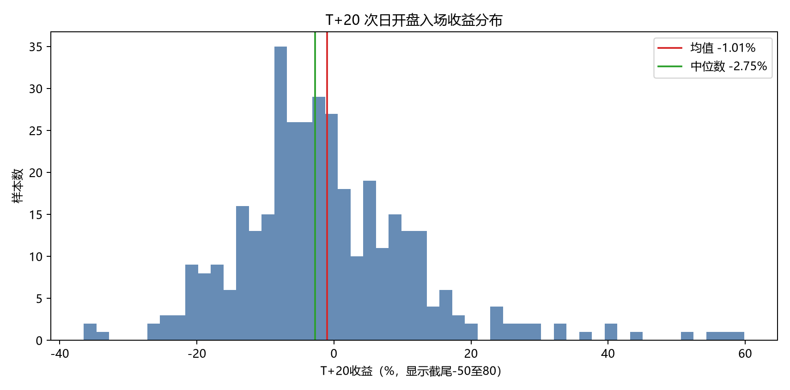
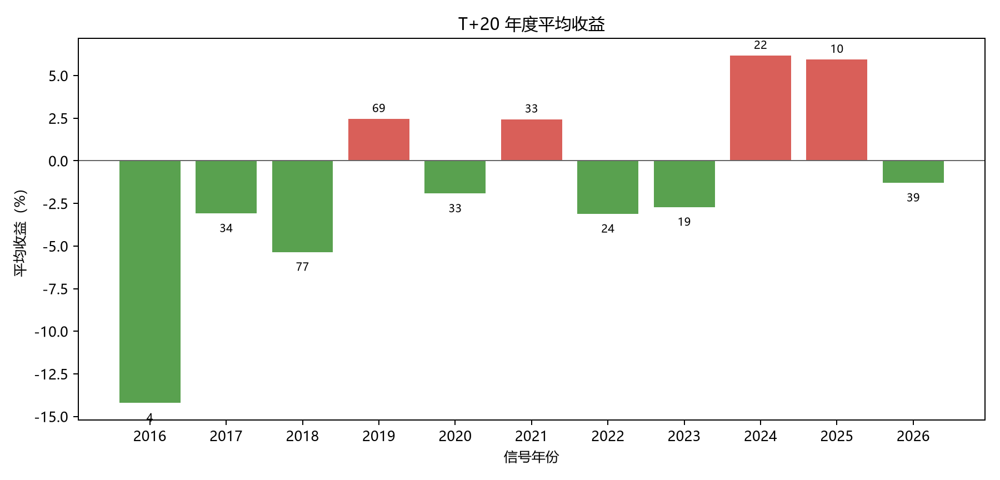
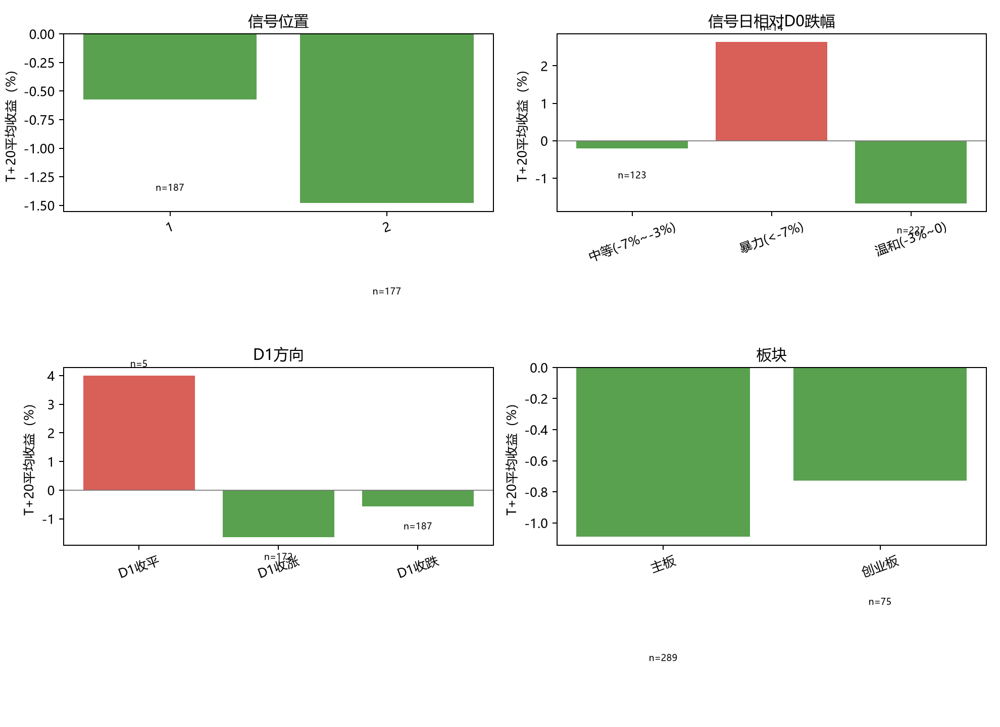
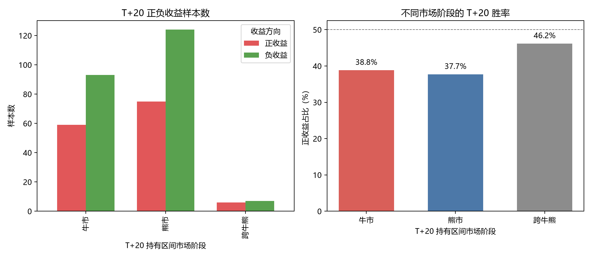
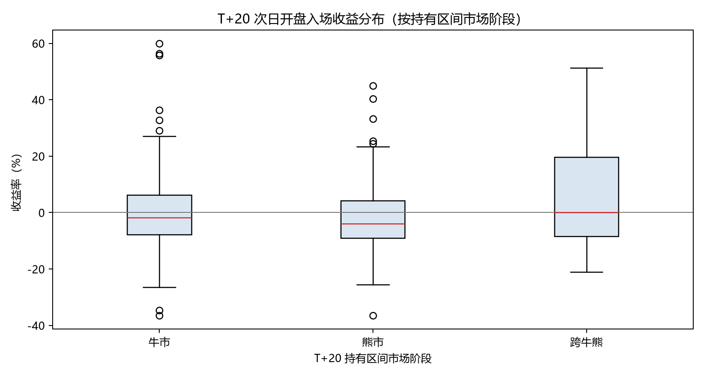

# 一字板回调策略：回测与可视化报告

回测日期：2026-09-30  
数据截止：2026-09-29  
研究区间：近10年

## 1. 最终策略规则

研究对象是一字涨停后两根有效K线内首次跌破板价的回调形态。以下为唯一正式口径：

1. D0前紧邻3根个股有效K线均不得收于涨停价。
2. D0为准一字涨停，OHLC与涨停价最多允许1分钱误差。
3. 排除上市不足60根K线、尚未首次开板的新股期，并剔除主板5%一字涨停近似识别的疑似ST。
4. D1、D2中首次后复权收盘低于D0后复权板价的交易日为信号日；每个D0最多一次信号。
5. 当前月截至信号日涨幅、前一个完整自然月涨幅均不得超过50%，不使用信号日后的月内数据。
6. D0后复权收盘价不得超过此前63根有效日线最低后复权低点的1.2倍，即相对前三个月最低点涨幅不得超过20%；窗口不含D0。

## 2. 回测口径

- 入场：信号日收盘，或次日开盘；次日一字涨停无法买入的样本从开盘口径剔除。
- 持有期：1、3、5、10、20根个股有效K线，停牌日不计。
- 收益：后复权个股收益；超额收益相对同期全市场每日再平衡等权组合。
- T+20市场阶段：信号日至第20根有效K线退出日全处于牛市/熊市则归入对应阶段，跨边界单列。
- 本报告是事件研究，不是含仓位、资金占用和交易成本的组合净值回测。

## 3. 核心回测结果

| 事件数 | 有效T+20样本 | 收盘入场T+20均值 | 次日开盘T+20均值 | 开盘中位数 | 开盘胜率 | 开盘超额 |
|---:|---:|---:|---:|---:|---:|---:|
| 368 | 364 | -2.59% | -1.01% | -2.75% | 38.5% | -1.50% |

### 3.1 各持有期完整统计

| 入场 | 持有期 | 样本数 | 平均收益 | 中位数 | 胜率 | 平均超额 |
|---|---:|---:|---:|---:|---:|---:|
| 信号日收盘 | 1 | 368 | -1.08% | -1.30% | 35.9% | -1.11% |
| 信号日收盘 | 3 | 368 | -2.10% | -1.95% | 32.9% | -1.98% |
| 信号日收盘 | 5 | 368 | -2.35% | -2.89% | 31.5% | -2.20% |
| 信号日收盘 | 10 | 366 | -2.67% | -3.59% | 31.4% | -2.63% |
| 信号日收盘 | 20 | 364 | -2.59% | -3.87% | 34.9% | -2.97% |
| 次日开盘 | 1 | 368 | +0.47% | +0.00% | 47.8% | +0.32% |
| 次日开盘 | 3 | 368 | -0.59% | -0.57% | 41.8% | -0.57% |
| 次日开盘 | 5 | 368 | -0.83% | -1.75% | 40.8% | -0.79% |
| 次日开盘 | 10 | 366 | -1.16% | -2.43% | 39.3% | -1.23% |
| 次日开盘 | 20 | 364 | -1.01% | -2.75% | 38.5% | -1.50% |

## 4. T+20分组统计

以下表格统一采用次日开盘入场、持有20根有效K线。

### 4.1 信号位于D1或D2
| 分组 | 样本数 | 平均收益 | 中位数 | 胜率 | P10 | P90 | 平均超额 |
|---|---:|---:|---:|---:|---:|---:|---:|
| D1首次跌破 | 187 | -0.57% | -2.31% | 41.2% | -16.92% | +15.30% | -1.47% |
| D2首次跌破 | 177 | -1.48% | -3.12% | 35.6% | -14.12% | +11.47% | -1.54% |

### 4.2 信号日回调幅度
| 分组 | 样本数 | 平均收益 | 中位数 | 胜率 | P10 | P90 | 平均超额 |
|---|---:|---:|---:|---:|---:|---:|---:|
| 中等(-7%~-3%) | 123 | -0.21% | -2.69% | 41.5% | -16.70% | +15.58% | -1.04% |
| 暴力(<-7%) | 14 | +2.64% | +7.53% | 57.1% | -16.52% | +20.41% | -1.81% |
| 温和(-3%~0) | 227 | -1.68% | -2.96% | 35.7% | -15.24% | +12.18% | -1.73% |

### 4.3 D1方向
| 分组 | 样本数 | 平均收益 | 中位数 | 胜率 | P10 | P90 | 平均超额 |
|---|---:|---:|---:|---:|---:|---:|---:|
| D1收平 | 5 | +4.00% | -2.59% | 40.0% | -10.47% | +25.00% | -0.41% |
| D1收涨 | 172 | -1.64% | -3.15% | 35.5% | -14.21% | +11.09% | -1.57% |
| D1收跌 | 187 | -0.57% | -2.31% | 41.2% | -16.92% | +15.30% | -1.47% |

### 4.4 D1是否涨停
| 分组 | 样本数 | 平均收益 | 中位数 | 胜率 | P10 | P90 | 平均超额 |
|---|---:|---:|---:|---:|---:|---:|---:|
| D1涨停 | 11 | -4.52% | -4.05% | 18.2% | -19.56% | +9.72% | -4.55% |
| D1非涨停 | 353 | -0.90% | -2.69% | 39.1% | -15.52% | +13.17% | -1.41% |

### 4.5 板块
| 分组 | 样本数 | 平均收益 | 中位数 | 胜率 | P10 | P90 | 平均超额 |
|---|---:|---:|---:|---:|---:|---:|---:|
| 主板 | 289 | -1.09% | -2.59% | 38.1% | -16.06% | +12.13% | -1.64% |
| 创业板 | 75 | -0.73% | -2.98% | 40.0% | -17.69% | +16.12% | -0.98% |

### 4.6 年度
| 分组 | 样本数 | 平均收益 | 中位数 | 胜率 | P10 | P90 | 平均超额 |
|---|---:|---:|---:|---:|---:|---:|---:|
| 2016 | 4 | -14.20% | -17.29% | 0.0% | -21.56% | -4.36% | -12.68% |
| 2017 | 34 | -3.09% | -4.34% | 32.4% | -11.87% | +8.61% | -2.12% |
| 2018 | 77 | -5.35% | -6.90% | 28.6% | -19.83% | +12.22% | -2.13% |
| 2019 | 69 | +2.46% | -1.17% | 43.5% | -9.55% | +13.45% | +0.59% |
| 2020 | 33 | -1.92% | -1.36% | 36.4% | -18.23% | +12.77% | -4.54% |
| 2021 | 33 | +2.43% | -0.20% | 48.5% | -8.33% | +15.83% | +0.42% |
| 2022 | 24 | -3.11% | -4.25% | 29.2% | -11.66% | +8.64% | -3.65% |
| 2023 | 19 | -2.71% | -0.95% | 36.8% | -7.77% | +1.72% | -3.57% |
| 2024 | 22 | +6.17% | +1.19% | 54.5% | -8.83% | +32.83% | +2.73% |
| 2025 | 10 | +5.93% | +0.70% | 50.0% | -4.21% | +14.65% | +0.79% |
| 2026 | 39 | -1.29% | -0.82% | 46.2% | -17.20% | +13.10% | -2.00% |

## 5. T+20与固定牛熊区间

固定市场阶段来自项目级 `scripts/market_regimes.py`。正收益为 `ret_open_20 > 0`，负收益为 `ret_open_20 <= 0`。

| T+20持有区间 | 样本数 | 正收益数 | 负收益数 | 正收益占比 | 平均收益 | 中位数 |
|---|---:|---:|---:|---:|---:|---:|
| 熊市 | 199 | 75 | 124 | 37.7% | -2.37% | -3.87% |
| 牛市 | 152 | 59 | 93 | 38.8% | +0.09% | -1.73% |
| 跨牛熊 | 13 | 6 | 7 | 46.2% | +6.76% | +0.00% |

牛市平均收益高于熊市，但牛市中位数仍为负；跨牛熊样本仅13个，均值受少数高收益尾部影响，不能视为稳定优势。

### 5.1 牛市负收益与熊市正收益样本

以下样本采用当前正式策略、次日开盘入场、持有20根有效K线；牛市负收益取收益最低10个，熊市正收益取收益最高10个，用于观察阶段内的反例与尾部，不代表阶段整体分布。

| 类型 | 股票 | D0 | 信号日 | T+20退出日 | D1/D2 | T+20收益 | 超额收益 |
|---|---|---|---|---|---:|---:|---:|
| 牛市负收益 | 600889.SH | 2020-12-09 | 2020-12-10 | 2021-01-08 | D1 | -36.46% | -31.03% |
| 牛市负收益 | 000526.SZ | 2021-07-06 | 2021-07-08 | 2021-08-05 | D2 | -34.63% | -36.48% |
| 牛市负收益 | 603389.SH | 2020-01-06 | 2020-01-08 | 2020-02-13 | D2 | -26.44% | -21.84% |
| 牛市负收益 | 002219.SZ | 2020-03-31 | 2020-04-01 | 2020-05-06 | D1 | -24.89% | -30.29% |
| 牛市负收益 | 000796.SZ | 2021-06-29 | 2021-06-30 | 2021-07-28 | D1 | -21.58% | -17.48% |
| 牛市负收益 | 600604.SH | 2026-05-20 | 2026-05-22 | 2026-06-22 | D2 | -20.38% | -14.29% |
| 牛市负收益 | 601595.SH | 2026-02-09 | 2026-02-11 | 2026-03-19 | D2 | -19.56% | -15.55% |
| 牛市负收益 | 300108.SZ | 2019-07-25 | 2019-07-29 | 2019-08-26 | D2 | -19.28% | -17.78% |
| 牛市负收益 | 300338.SZ | 2020-04-10 | 2020-04-13 | 2020-05-14 | D1 | -19.28% | -21.49% |
| 牛市负收益 | 002526.SZ | 2026-05-25 | 2026-05-26 | 2026-06-24 | D1 | -18.10% | -12.65% |
| 熊市正收益 | 600560.SH | 2024-02-05 | 2024-02-07 | 2024-03-14 | D2 | +44.94% | +19.94% |
| 熊市正收益 | 000007.SZ | 2018-10-15 | 2018-10-16 | 2018-11-13 | D1 | +40.40% | +27.47% |
| 熊市正收益 | 600449.SH | 2024-02-01 | 2024-02-02 | 2024-03-11 | D1 | +33.28% | +16.02% |
| 熊市正收益 | 002173.SZ | 2024-01-30 | 2024-01-31 | 2024-03-07 | D1 | +25.30% | +18.59% |
| 熊市正收益 | 300648.SZ | 2018-02-01 | 2018-02-02 | 2018-03-09 | D1 | +24.47% | +17.53% |
| 熊市正收益 | 600730.SH | 2026-07-17 | 2026-07-20 | 2026-08-17 | D1 | +23.40% | +9.46% |
| 熊市正收益 | 603297.SH | 2026-07-28 | 2026-07-29 | 2026-08-26 | D1 | +20.76% | +12.59% |
| 熊市正收益 | 002193.SZ | 2024-07-15 | 2024-07-17 | 2024-08-14 | D2 | +18.12% | +17.55% |
| 熊市正收益 | 603429.SH | 2026-07-28 | 2026-07-29 | 2026-08-26 | D1 | +17.99% | +9.82% |
| 熊市正收益 | 300629.SZ | 2018-10-16 | 2018-10-18 | 2018-11-15 | D2 | +17.35% | -4.00% |

明细：`../results/regime_t20_extreme_samples.csv`。

可视化：[牛市负收益与熊市正收益多周期K线长图](../figures/regime-t20-extreme-k-lines.html)。每个样本同时展示日线、周线、个股月线、创业板指月线和上证指数月线，统一使用对数价格轴；日线前后各取44根，周线和月线的辅助范围均映射到日线完整视窗。

## 6. 典型样本与多周期K线

样本按次日开盘入场、持有20根K线选择：最高10个、最接近全样本均值10个、最低10个。

| 类型 | 股票 | D0 | 信号日 | D1/D2 | T+20收益 | 超额收益 |
|---|---|---|---|---:|---:|---:|
| 高收益 | 600078.SH | 2019-06-24 | 2019-06-26 | D2 | +59.90% | +62.53% |
| 高收益 | 300063.SZ | 2019-12-11 | 2019-12-12 | D1 | +56.34% | +46.83% |
| 高收益 | 002305.SZ | 2025-04-25 | 2025-04-28 | D1 | +55.81% | +49.54% |
| 高收益 | 605050.SH | 2021-11-16 | 2021-11-17 | D1 | +51.28% | +47.26% |
| 高收益 | 600560.SH | 2024-02-05 | 2024-02-07 | D2 | +44.94% | +19.94% |
| 高收益 | 000750.SZ | 2024-09-06 | 2024-09-10 | D2 | +40.74% | +18.15% |
| 高收益 | 000007.SZ | 2018-10-15 | 2018-10-16 | D1 | +40.40% | +27.47% |
| 高收益 | 000155.SZ | 2020-06-08 | 2020-06-10 | D2 | +36.29% | +20.32% |
| 高收益 | 600449.SH | 2024-02-01 | 2024-02-02 | D1 | +33.28% | +16.02% |
| 高收益 | 300772.SZ | 2019-09-04 | 2019-09-05 | D1 | +32.83% | +33.69% |
| 接近均值 | 300612.SZ | 2019-08-14 | 2019-08-15 | D1 | -1.00% | -12.68% |
| 接近均值 | 600611.SH | 2023-01-19 | 2023-01-30 | D2 | -0.95% | -3.89% |
| 接近均值 | 600081.SH | 2020-05-11 | 2020-05-13 | D2 | -0.93% | -6.30% |
| 接近均值 | 000055.SZ | 2019-11-22 | 2019-11-25 | D1 | -1.10% | -5.75% |
| 接近均值 | 300255.SZ | 2020-05-13 | 2020-05-14 | D1 | -0.90% | -4.14% |
| 接近均值 | 603038.SH | 2019-05-28 | 2019-05-30 | D2 | -1.17% | -1.95% |
| 接近均值 | 000008.SZ | 2026-07-14 | 2026-07-15 | D1 | -1.20% | -6.62% |
| 接近均值 | 605277.SH | 2026-03-17 | 2026-03-18 | D1 | -0.82% | -0.83% |
| 接近均值 | 300375.SZ | 2019-06-10 | 2019-06-12 | D2 | -0.77% | -0.86% |
| 接近均值 | 300221.SZ | 2020-05-20 | 2020-05-22 | D2 | -1.30% | -10.02% |
| 低收益 | 002341.SZ | 2024-01-05 | 2024-01-08 | D1 | -36.49% | -9.71% |
| 低收益 | 600889.SH | 2020-12-09 | 2020-12-10 | D1 | -36.46% | -31.03% |
| 低收益 | 000526.SZ | 2021-07-06 | 2021-07-08 | D2 | -34.63% | -36.48% |
| 低收益 | 603389.SH | 2020-01-06 | 2020-01-08 | D2 | -26.44% | -21.84% |
| 低收益 | 000678.SZ | 2018-01-15 | 2018-01-16 | D1 | -25.61% | -13.03% |
| 低收益 | 300513.SZ | 2018-07-17 | 2018-07-19 | D2 | -25.05% | -20.65% |
| 低收益 | 002219.SZ | 2020-03-31 | 2020-04-01 | D1 | -24.89% | -30.29% |
| 低收益 | 300368.SZ | 2018-01-23 | 2018-01-24 | D1 | -24.10% | -14.81% |
| 低收益 | 300100.SZ | 2017-10-12 | 2017-10-13 | D1 | -22.58% | -20.49% |
| 低收益 | 002766.SZ | 2018-01-08 | 2018-01-09 | D1 | -22.37% | -6.67% |

[打开30个典型样本的日线、周线、个股月线、创业板指月线和上证指数月线长图](../figures/yizi-mobile-k-lines.html)

长图采用对数价格坐标、线性成交量坐标；日线前后各取44根，周线及所有月线的黄色辅助范围均映射到日线完整视窗。

[打开随机正收益50个与负收益50个样本长图](../figures/yizi-random-positive-negative-k-lines.html)

随机图使用固定种子 `20260930`，每组50个有效 T+20 样本，沿用同一套日线44/44、周线/月线22/22及指数月线绘图规范。

## 7. 规则边界复核

- `002428.SZ`：2026-03-20准一字板，开盘/最低仅比涨停价低1分钱；2026-03-23（D1）首次跌破。当前月截至信号日-15.87%，前月+37.34%，满足过滤。
- `600223.SH`：2019-12-20之前更早阶段虽有连板，但紧邻D0的前三根有效K线均非涨停，按最终规则保留。

## 8. 最终结论

该形态整体更接近一字板失守后的弱势延续，而不是稳定反弹买点。当前正式策略次日开盘持有20根有效K线平均收益-1.01%，中位数-2.75%，胜率38.5%，平均超额收益-1.50%。

市场阶段能够解释一部分差异：熊市表现弱于牛市，但牛市本身仍无稳定正期望。牛市负收益和熊市正收益反例显示，阶段标签不能替代个股形态后的风险控制；后续研究应叠加板块强度、成交量结构与反转确认。

## 9. 风险与限制

- 信号日收盘入场存在收盘确认后的成交时点问题，实际执行优先参考次日开盘。
- 未计佣金、印花税、滑点、涨跌停排队成交、仓位上限、信号重叠和资金占用。
- 数据无正式ST标签，主板5%一字板仅是近似排除。
- 少量重整转增、特殊除权事件可能导致涨停参考价误判。
- 分组结果是条件相关性，不代表因果；小样本分组尤其容易受极端值影响。

## 10. 唯一报告与数据产物

本文件是该策略唯一的结果、结论与可视化报告。

- 正式事件明细：`../results/yizi_pullback_d2_events.csv`、`../results/yizi_pullback_d2_summary.csv`
- 牛熊分析：`../results/regime_t20_events.csv`、`../results/regime_t20_summary.csv`
- 牛熊反例：`../results/regime_t20_extreme_samples.csv`、`../figures/regime-t20-extreme-k-lines.html`
- 随机正负收益样本：`../figures/yizi-random-positive-negative-k-lines.html`
- 策略代码：`../strategy/pattern_yizi_pullback.py`
- 报告生成：`../strategy/build_backtest_report.py`
- 多周期图生成：`../strategy/make_yizi_mobile_charts.py`、`../strategy/make_yizi_random_charts.py`
